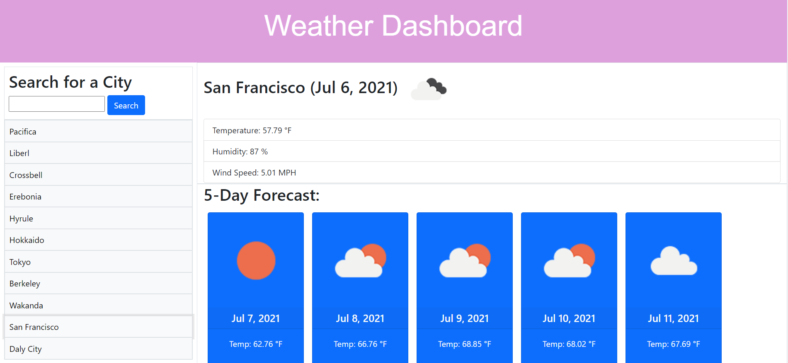

# weather-dashboard
This is a simple weather dashboard that allows a user to enter a city and get current weather conditions as well as the conditions for the next 5 days. It includes temperature, wind speed, and humidity. This dashboard also saves your searches so you can go back and click them if you wanted to see the weather conditions for a previously searched city once again.

## Getting Started

To start simply click the link below to get started. Then enter a city in the search input and grab the current and future weather conditions for that particular city.

## Built With

* [HTML](https://developer.mozilla.org/en-US/docs/Web/HTML)
* [CSS](https://developer.mozilla.org/en-US/docs/Web/CSS)
* [Git](https://git-scm.com/about)
* [Github](https://github.com/)
* [Javascript](https://developer.mozilla.org/en-US/docs/Web/JavaScript)
* [Moment.js](https://momentjs.com/)
* [JQuery](https://www.w3schools.com/jquery/jquery_intro.asp)
* [Bootstrap](https://getbootstrap.com/docs/5.0/getting-started/introduction/)

## Deployed Link

* [See Live Site - Click me!]()

## Preview

## Authors

* **Eajay Delos Santos** 

    - [Link to Github](https://github.com/EajayD)
    - [Link to LinkedIn](https://www.linkedin.com/in/eajay-delos-santos-912950214/)

## Acknowledgments

* w3Schools
* Jquery and Bootstrap docs
* Class repos and code drills
* Google-fu!
* Met up with some classmates to psudeo code and get an idea of how to approach this
